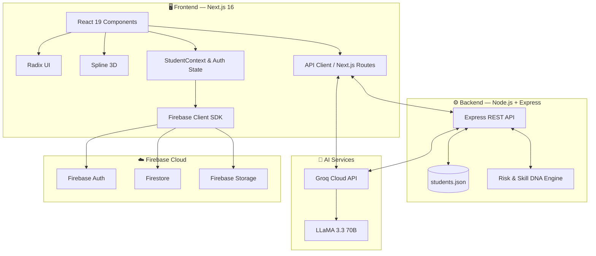
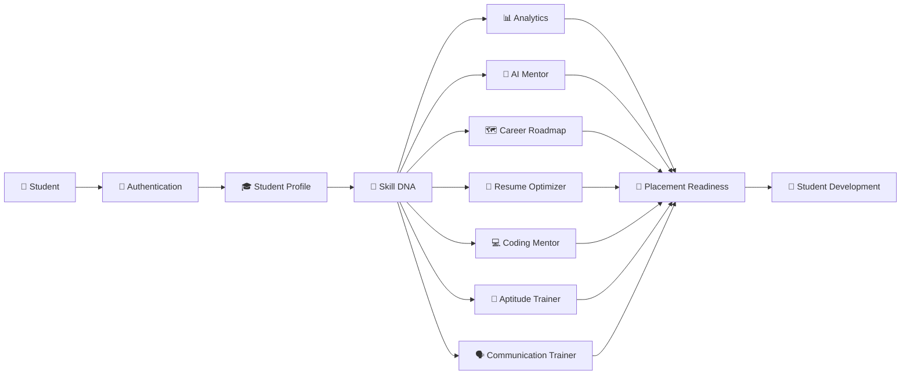
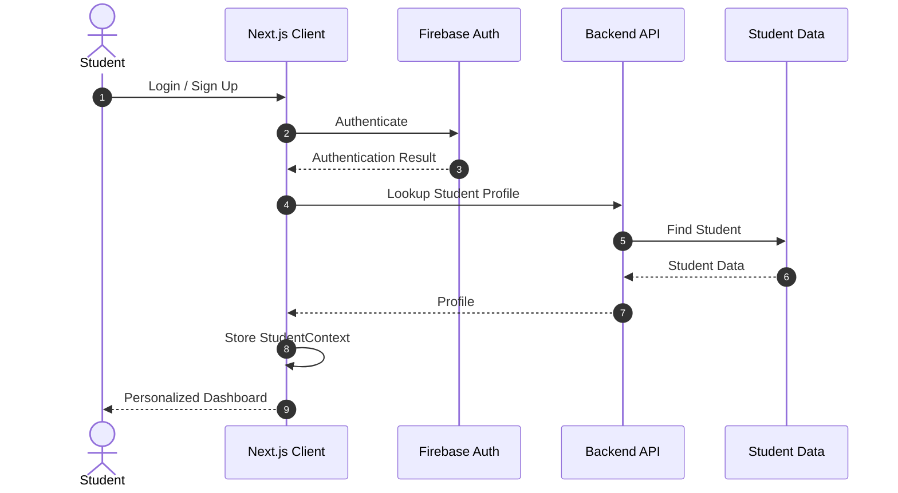
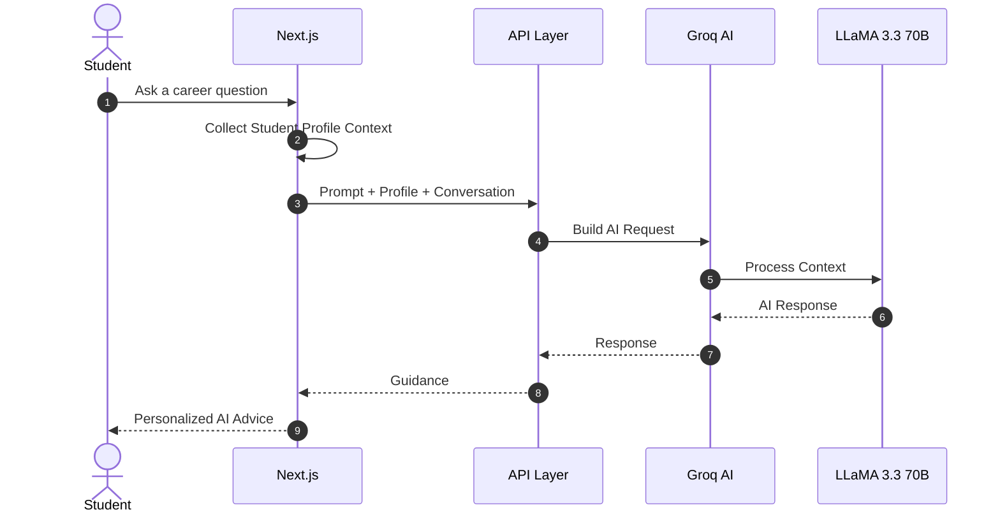
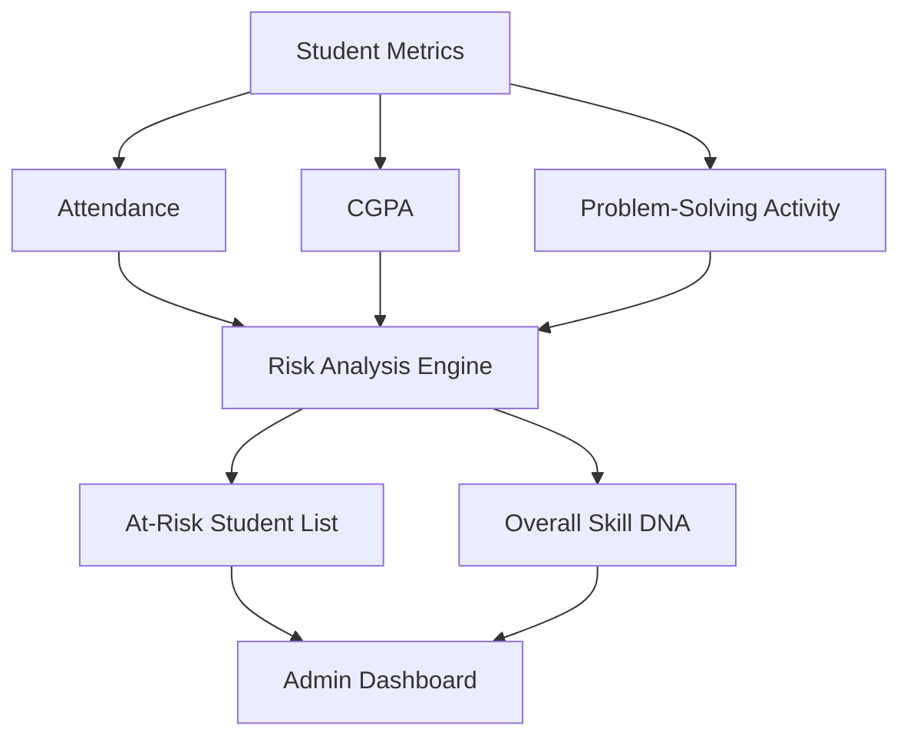

<div align="center">

# 🧭 Skill GPS

### AI-Powered Student Skill Mentoring & Career Guidance Platform

**Track your skills. Discover your gaps. Build your roadmap. Navigate your career.**

[](https://nextjs.org/)
[](https://react.dev/)
[](https://www.typescriptlang.org/)
[](https://tailwindcss.com/)
[](https://nodejs.org/)
[](https://expressjs.com/)
[](https://firebase.google.com/)
[](https://groq.com/)
[](https://www.framer.com/motion/)
[](https://recharts.org/)

</div>

---

## 🌟 What is Skill GPS?

**Skill GPS** is a student progress management, placement-readiness tracking, and AI-powered career mentoring platform.

Students usually manage their academics, coding practice, GitHub activity, resumes, aptitude preparation, communication practice, and career planning across different platforms. Skill GPS brings these areas together into one intelligent platform.

It creates a student's **Skill DNA** from their available academic, technical, coding, and career-development information and uses that context to provide meaningful guidance.

> 🧭 **Skill GPS answers three questions:**  
> **Where am I? → Where do I want to go? → What should I do next?**

---

## 🎯 Why Skill GPS?

| Common Student Challenge | Skill GPS Approach |
|---|---|
| Skills are scattered across different platforms | Centralized student development profile |
| Students don't know their skill gaps | Skill DNA and visual skill analytics |
| Career advice is often generic | Context-aware AI Career Mentor |
| Learning paths are unclear | Dynamic role-specific career roadmaps |
| Resumes may miss important keywords | ATS Resume Optimizer |
| Placement preparation is fragmented | Coding + aptitude + communication modules |
| Colleges lack a consolidated progress view | Admin analytics and risk insights |

---

# ✨ Core Features

## 🎓 1. Student Profile & Skill DNA

Skill GPS builds a consolidated picture of student development.

### Tracks

- 📚 CGPA
- 📅 Attendance
- 💻 LeetCode activity and streaks
- 🧩 SkillRack activity
- 🐙 GitHub contributions
- 🏆 Badges and achievements
- 📊 Technical skill distribution

The collected information can be represented using visual analytics such as **Skill DNA radar charts**, helping students understand their strengths and gaps.

---

## 🤖 2. AI Career Mentor

The **AI Career Mentor** is the conversational intelligence layer of Skill GPS.

Instead of treating every student the same, the system can combine the student's profile information with the current conversation.

### Example

```text
Student
   │
   │ "How should I prepare for an SDE-1 role?"
   ▼
┌──────────────────────────────┐
│      Student Context         │
│                              │
│ Skills • CGPA • Streaks      │
│ Career Goal • Profile Data   │
└──────────────┬───────────────┘
               │
               ▼
┌──────────────────────────────┐
│       AI Mentor Engine       │
│      Groq + LLaMA 3.3 70B    │
└──────────────┬───────────────┘
               │
               ▼
      Personalized Guidance
               │
               ▼
      Student's Next Steps
```

### The mentor can support

- Career questions
- Skill improvement guidance
- Placement preparation
- Learning direction
- Role-specific advice
- Personalized recommendations

The current implementation uses **Groq Cloud API with `llama-3.3-70b-versatile`** for AI-powered interactions.

---

## 🗺️ 3. Dynamic Career Roadmap Generator

Students can select a target career role and receive a structured roadmap.

### Example Career Paths

```text
                 Target Career
                      │
          ┌───────────┼───────────┐
          ▼           ▼           ▼
     Full Stack     AI / ML    Data Science
          │           │           │
          ▼           ▼           ▼
       Skills      Skills      Skills
          │           │           │
          ▼           ▼           ▼
      Projects    Projects    Projects
          │           │           │
          └───────────┼───────────┘
                      ▼
               Placement Ready
```

Roadmaps are designed around milestones so students can understand what to learn and what to work on next.

---

## 📄 4. ATS Resume Optimizer

Skill GPS helps students analyze their resumes before applying for opportunities.

### Workflow

```text
Resume PDF
    │
    ▼
pdf-parse
    │
    ▼
Extract Resume Text
    │
    ▼
Groq AI Analysis
    │
    ├──► Identify Skills
    ├──► Find Missing Keywords
    ├──► Evaluate ATS Compatibility
    └──► Generate Recommendations
    │
    ▼
Updated Student Skill DNA
```

### Output can include

- 📈 ATS-oriented score
- 🔎 Missing keywords
- 🧠 Identified skills
- 💡 Improvement recommendations

---

## 🗣️ 5. Spoken Communication Trainer

The communication module helps students practice and improve spoken communication.

It focuses on areas such as:

- Grammar
- Fluency
- Sentence quality
- Spoken communication performance
- AI-assisted feedback

The goal is to make communication practice a continuous part of placement preparation.

---

## 🧮 6. AI Aptitude Trainer

Students can practice quantitative aptitude using dynamically generated questions.

The module supports AI-assisted preparation for placement-oriented aptitude assessments.

```text
Choose Topic
     ↓
Generate Question
     ↓
Attempt
     ↓
Evaluate
     ↓
AI Feedback
     ↓
Improve
```

---

## 💻 7. AI Coding Mentor

The Coding Mentor provides AI-assisted programming support.

### Capabilities

- Code review
- Debugging assistance
- Programming guidance
- Explanation of coding issues

This complements external competitive-programming platforms by giving students an intelligent feedback layer.

---

## 📊 8. College Admin Dashboard

Skill GPS is not limited to individual students.

The admin dashboard provides institution-level visibility into student development.

### Admin capabilities

- 👥 View student profiles
- 📊 Analyze Skill DNA
- 🚩 Identify students requiring attention
- 📈 Analyze skill distribution
- 🎯 Monitor placement-readiness indicators

The backend analytics engine can evaluate configurable indicators such as attendance, CGPA, and problem-solving activity.

---

# 🧠 Skill DNA

One of the core ideas behind Skill GPS is **Skill DNA**.

Instead of measuring a student using only CGPA or coding performance, the platform brings multiple dimensions together.

```text
             ┌─────────────────────┐
             │      Skill DNA       │
             └──────────┬──────────┘
                        │
       ┌────────────────┼────────────────┐
       │                │                │
       ▼                ▼                ▼
   Academics         Coding           GitHub
       │                │                │
       └────────────────┼────────────────┘
                        │
              ┌─────────┴─────────┐
              ▼                   ▼
          Resume             Communication
              │                   │
              └─────────┬─────────┘
                        ▼
                Placement Profile
```

This gives students a broader understanding of their current development rather than relying on one metric.

---

# 🏗️ System Architecture



---

# 🔄 End-to-End Platform Flow



---

# 🔬 Detailed Workflows

## 1. Student Onboarding & Authentication



---

## 2. Context-Aware AI Mentoring



---

## 3. Resume & Certificate Processing

1. Student uploads a PDF.
2. `pdf-parse` extracts the document text.
3. Extracted text is processed by the AI layer.
4. Structured information is generated.
5. Skills and keywords are identified.
6. ATS-oriented analysis is returned.
7. Relevant information can contribute to the student's Skill DNA.

---

## 4. Admin Risk & Analytics



---

# 🛠️ Technology Stack

<div align="center">

### 🎨 Frontend


<br><br>


</div>

| Technology | Purpose |
|---|---|
| **Next.js 16** | Application framework and App Router |
| **React 19** | Component-based UI development |
| **TypeScript** | Type-safe development |
| **Tailwind CSS v4** | Responsive styling |
| **Radix UI** | Accessible UI primitives |
| **Framer Motion** | Animations and page transitions |
| **Spline** | Interactive 3D visuals |
| **Recharts** | Skill DNA and analytics charts |
| **Lucide React** | UI icons |

---

<div align="center">

### ⚙️ Backend


<br><br>


</div>

| Technology | Purpose |
|---|---|
| **Node.js** | Backend runtime |
| **Express.js** | REST API server |
| **JavaScript** | Backend implementation |
| **Axios** | HTTP communication |
| **CORS** | Cross-origin request handling |
| **dotenv** | Environment configuration |
| **students.json** | Current flat-file student data store |

---

<div align="center">

### 🔥 Firebase & Cloud


<br><br>


</div>

| Service | Purpose |
|---|---|
| **Firebase Authentication** | Student and admin authentication |
| **Firestore** | Cloud data services |
| **Firebase Storage** | File/document storage |
| **Firebase SDK v12** | Client-side Firebase integration |

---

<div align="center">

### 🤖 AI & LLM


</div>

| Technology | Purpose |
|---|---|
| **Groq Cloud API** | Fast AI inference |
| **LLaMA 3.3 70B** | AI generation and contextual mentoring |
| **Context-aware prompting** | Uses student profile information for personalized guidance |
| **Structured AI responses** | Supports roadmap, resume, coding and mentoring workflows |

---

<div align="center">

### 📄 Document Processing


</div>

| Technology | Purpose |
|---|---|
| **pdf-parse** | Extract text from resumes and certificates |
| **Groq + LLaMA** | Analyze extracted document content |
| **ATS Analysis** | Identify skills, keywords and resume improvement areas |

---

## 🧩 Stack at a Glance

<div align="center">


<br><br>


</div>

### 🔗 Technology Flow

```text
┌───────────────────────────────────────────────────────────────┐
│                         SKILL GPS                             │
└───────────────────────────────────────────────────────────────┘
                              │
              ┌───────────────┴───────────────┐
              ▼                               ▼
       🎨 FRONTEND                       ⚙️ BACKEND
              │                               │
   Next.js • React • TS              Node.js • Express
   Tailwind • Radix UI               Axios • CORS • dotenv
   Framer Motion • Spline
   Recharts • Lucide
              │                               │
              └───────────────┬───────────────┘
                              ▼
                    🔥 FIREBASE SERVICES
                              │
             Auth • Firestore • Storage
                              │
                              ▼
                         🤖 AI LAYER
                              │
                    Groq Cloud API
                              │
                       LLaMA 3.3 70B
                              │
                              ▼
                     🧠 INTELLIGENT
                       STUDENT GUIDANCE
                              │
          ┌───────────┬───────┼───────┬───────────┐
          ▼           ▼       ▼       ▼           ▼
       Mentor      Roadmap  Resume  Coding   Communication
```

> **Source-aligned stack:** The technologies above are based on the project's original README, including Next.js 16, React 19, TypeScript, Tailwind CSS v4, Radix UI, Framer Motion, Spline, Recharts, Firebase SDK v12, Node.js, Express.js, `pdf-parse`, Groq Cloud API, and LLaMA 3.3 70B.

---

# 📁 Project Structure

```text
Skill_GPS/
│
├── backend/
│   ├── server.js
│   ├── students.json
│   ├── package.json
│   └── .env.example
│
├── frontend/
│   ├── src/
│   │   ├── app/
│   │   │   ├── admin/
│   │   │   │   └── # College Admin Dashboard
│   │   │   │
│   │   │   ├── api/
│   │   │   │   └── # AI, certificates and insights routes
│   │   │   │
│   │   │   ├── dashboard/
│   │   │   │   └── # Student Dashboard
│   │   │   │
│   │   │   └── page.tsx
│   │   │
│   │   ├── components/
│   │   │   └── # Reusable UI components
│   │   │
│   │   └── lib/
│   │       ├── firebase.ts
│   │       ├── groq.ts
│   │       ├── api-client.ts
│   │       └── StudentContext.tsx
│   │
│   ├── package.json
│   └── .env.example
│
└── README.md
```

---

# 📡 API Reference

### 👥 Student Management

| Method | Endpoint | Description |
|---|---|---|
| `GET` | `/api/students` | Fetch students |
| `GET` | `/api/students/:id` | Fetch a student |
| `GET` | `/api/students/lookup/email` | Lookup by email |
| `POST` | `/api/students` | Register student |
| `PUT` | `/api/students/:id` | Update student |
| `DELETE` | `/api/students/:id` | Delete student |

### 🤖 AI Services

| Method | Endpoint | Description |
|---|---|---|
| `POST` | `/api/chat` | AI Career Mentor |
| `POST` | `/api/aptitude` | Generate aptitude questions |
| `POST` | `/api/coding-mentor` | AI code reviewer/debug helper |
| `POST` | `/api/resume-optimizer` | Resume ATS analysis |
| `POST` | `/api/career-roadmap` | Career roadmap generation |
| `POST` | `/api/communication-trainer` | Communication evaluation |

### 📊 Analytics

| Method | Endpoint | Description |
|---|---|---|
| `GET` | `/api/analytics/risk` | Risk-flagged students |
| `GET` | `/api/analytics/overall-dna` | Institution-wide Skill DNA |
| `GET` | `/api/insights/:studentId` | Student AI insights |
| `GET` | `/api/health` | API health check |

### 🔐 Administration

| Method | Endpoint | Description |
|---|---|---|
| `POST` | `/api/admin/login` | Admin login validation |

---

# 🚀 Getting Started

## Prerequisites

- **Node.js** v18+
- **npm** v9+
- **Groq API Key**
- **Firebase Project**

---

## 1️⃣ Clone

```bash
git clone https://github.com/your-username/Skill_GPS.git
cd Skill_GPS
```

---

## 2️⃣ Backend

```bash
cd backend
npm install
```

Create `.env`:

```env
GROQ_API_KEY=gsk_your_groq_api_key_here
PORT=5000
```

Run:

```bash
npm run dev
```

Backend:

```text
http://localhost:5000
```

---

## 3️⃣ Frontend

Open a new terminal:

```bash
cd frontend
npm install
```

Create `.env.local`:

```env
NEXT_PUBLIC_FIREBASE_API_KEY=your_api_key
NEXT_PUBLIC_FIREBASE_AUTH_DOMAIN=your_project.firebaseapp.com
NEXT_PUBLIC_FIREBASE_PROJECT_ID=your_project_id
NEXT_PUBLIC_FIREBASE_STORAGE_BUCKET=your_project.firebasestorage.app
NEXT_PUBLIC_FIREBASE_MESSAGING_SENDER_ID=your_sender_id
NEXT_PUBLIC_FIREBASE_APP_ID=your_app_id
NEXT_PUBLIC_FIREBASE_MEASUREMENT_ID=your_measurement_id

GROQ_API_KEY=gsk_your_groq_api_key_here
```

Run:

```bash
npm run dev
```

Frontend:

```text
http://localhost:3000
```

---

# 🔐 Security & Data Governance

Skill GPS handles student-related information, so security should remain a core part of the platform.

### 🔑 API Key Protection

`GROQ_API_KEY` is intended to remain server-side and should never be exposed in client browser bundles.

### 🔥 Firebase Security

Firestore and Storage rules should restrict access to authenticated and authorized users.

### 👤 Student Context Isolation

AI requests should maintain boundaries around the active student's context to prevent cross-student information exposure.

### 🌍 Environment Configuration

Sensitive credentials should be stored in environment variables.

> ⚠️ **Never commit real API keys, passwords, or production credentials to GitHub.**

---

# 📈 Placement Readiness Model

Skill GPS brings multiple preparation dimensions together:

```text
                 ┌──────────────────┐
                 │ Academic Progress│
                 └────────┬─────────┘
                          │
┌──────────────────┐      │      ┌──────────────────┐
│ Coding Practice  │──────┼──────│ GitHub Activity  │
└──────────────────┘      │      └──────────────────┘
                          ▼
                 ┌──────────────────┐
                 │    Skill DNA     │
                 └────────┬─────────┘
                          │
          ┌───────────────┼───────────────┐
          ▼               ▼               ▼
      Resume          Aptitude      Communication
          │               │               │
          └───────────────┼───────────────┘
                          ▼
                 ┌──────────────────┐
                 │ Career Roadmap   │
                 └────────┬─────────┘
                          ▼
                 🎯 Placement Preparation
```

---

# 🧩 Platform Modules at a Glance

| Module | Purpose |
|---|---|
| 🎓 Student Profile | Central student development profile |
| 🧬 Skill DNA | Visual representation of skills and progress |
| 🤖 AI Mentor | Personalized conversational career guidance |
| 🗺️ Career Roadmap | Role-specific learning milestones |
| 📄 Resume Optimizer | ATS-oriented resume analysis |
| 💻 Coding Mentor | Code review and debugging support |
| 🧮 Aptitude Trainer | Placement aptitude practice |
| 🗣️ Communication Trainer | Spoken communication improvement |
| 📊 Admin Dashboard | College-level analytics |
| 🚩 Risk Analytics | Identify students requiring attention |

---

# 🌱 Future Scope

The platform can be extended with:

- 🔗 Direct LeetCode integration
- 🔗 Direct SkillRack integration
- 🐙 GitHub API synchronization
- 📈 Historical student-progress trends
- 🎤 More advanced speech analysis
- 📄 Resume-to-job matching
- 🧠 Expanded AI learning recommendations
- 🗄️ Migration from flat-file storage to a production database
- 🔐 More granular role-based access control
- 🏫 Expanded institutional reporting
- 📊 Advanced placement analytics

---

# 💼 Use Cases

### 👨‍🎓 For Students

> Understand your current skills, identify gaps, prepare for placements, and follow a personalized career path.

### 🏫 For Colleges

> Get a consolidated view of student development and institution-wide skill distribution.

### 🤖 For AI-Assisted Learning

> Use student context to generate more relevant career guidance instead of generic recommendations.

---

# 🧪 Current Project Status

Skill GPS currently brings together:

```text
✅ Student Profile Management
✅ Skill DNA Analytics
✅ AI Career Mentor
✅ Career Roadmap Generator
✅ ATS Resume Optimizer
✅ Aptitude Trainer
✅ Coding Mentor
✅ Communication Trainer
✅ Admin Dashboard
✅ Risk Analytics
✅ Firebase Authentication / Services
✅ Groq AI Integration
```

---

# 🔮 Vision

Skill GPS is built around the idea that **career development should be measurable, personalized, and continuous**.

A student should not have to visit ten different platforms to understand their progress.

Skill GPS aims to provide one connected journey:

```text
Discover
   ↓
Measure
   ↓
Identify Skill Gaps
   ↓
Learn
   ↓
Practice
   ↓
Improve
   ↓
Track Progress
   ↓
Prepare for Career
```

---

# ⭐ The Idea Behind the Name

### 🧭 Skill GPS

Just like a GPS helps you navigate from your current location to your destination, **Skill GPS helps students navigate from their current skill level to their career goal.**

```text
CURRENT STATE
     │
     │  Skill Analysis
     ▼
SKILL GAP
     │
     │  AI Guidance
     ▼
ROADMAP
     │
     │  Practice + Progress
     ▼
CAREER GOAL
```

> **Your career is the destination.  
> Your skills are the route.  
> Skill GPS helps you navigate. 🧭**

---

# 👥 Development Areas

The platform can be developed across multiple engineering areas:

- 🎨 **Frontend** — UI, dashboards, charts, animations
- ⚙️ **Backend** — REST APIs and business logic
- 🤖 **AI** — Prompt engineering and AI workflows
- 📊 **Analytics** — Skill DNA and risk analysis
- 🔗 **Integrations** — Coding platforms and GitHub
- 🔐 **Security** — Authentication and authorization
- 🧪 **Testing** — Unit and integration testing

---

# 📜 License

Add the appropriate project license here.

---

<div align="center">

## 🧭 Skill GPS

### **Track. Learn. Improve. Navigate.**

**AI-powered student development for a smarter career journey.**

⭐ **If this project is useful, consider giving it a star!**

</div>
